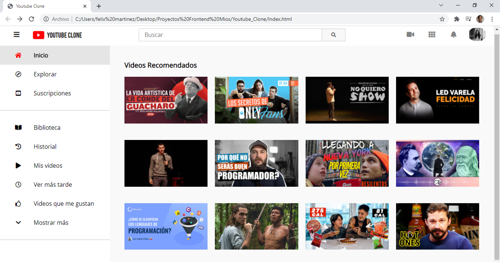
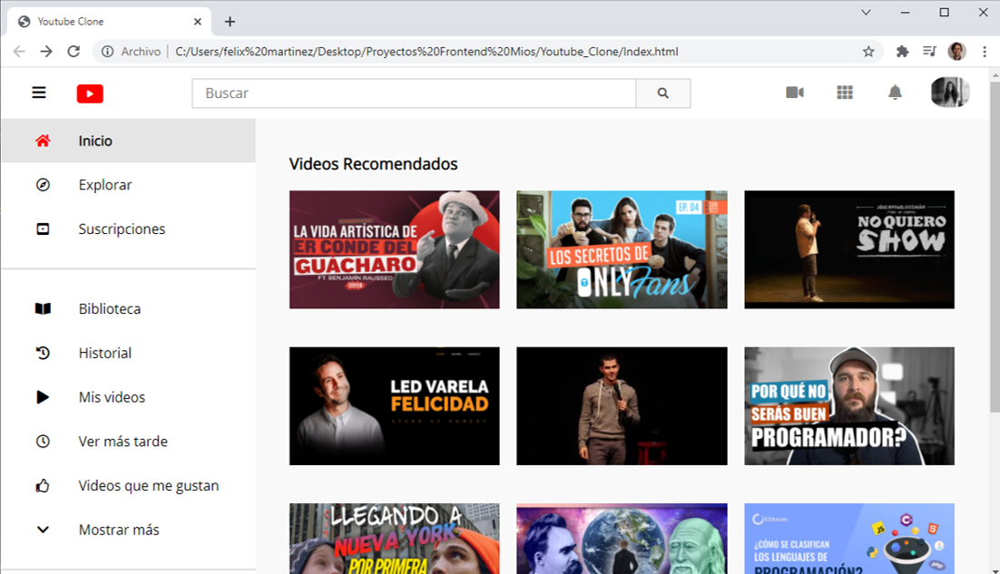
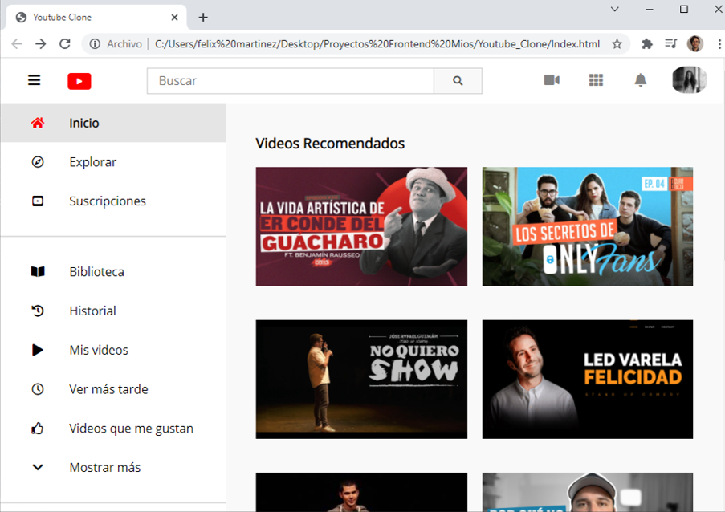
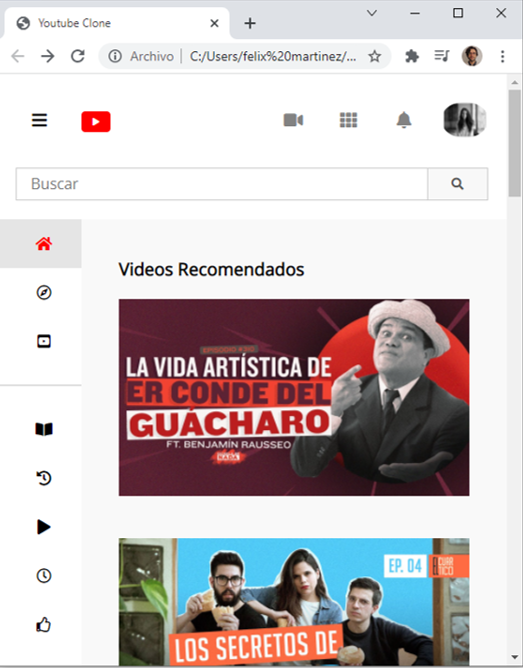
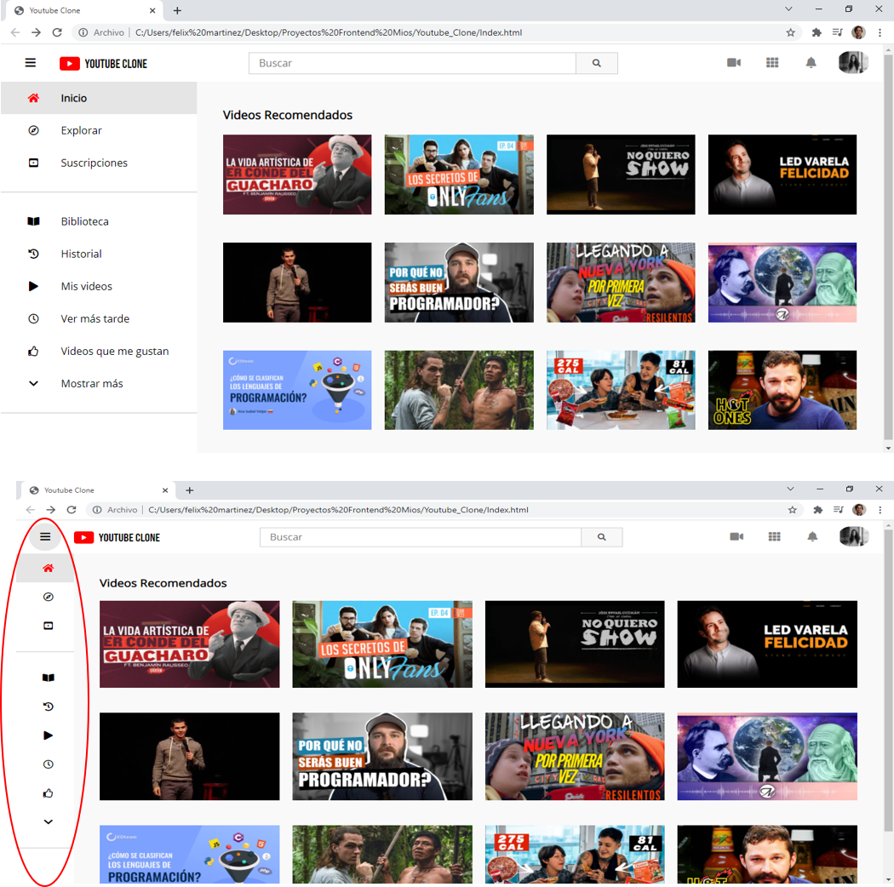

# Youtube Clone

Se realiza creación de página de inicio de Youtube

## Descripción

Para la creación se utilizó HTML, CSS y JavaScrip.

El objetivo de este repositorio consiste en realizar un primer vistazo de la página principal de Youtube, simulando la dinámica de la página original con el orden del contenido que presenta.

## Screenshots del Proyecto

### Visualización de página con pantallas superiores 1200px

### Visualización de página con pantallas de 1200px a 992px

### Visualización de página con pantallas de 992px a 768px

### Visualización de página con pantallas menores a 576px

### Cambio de pantalla al seleccionar barra lateral o disminur ancho

